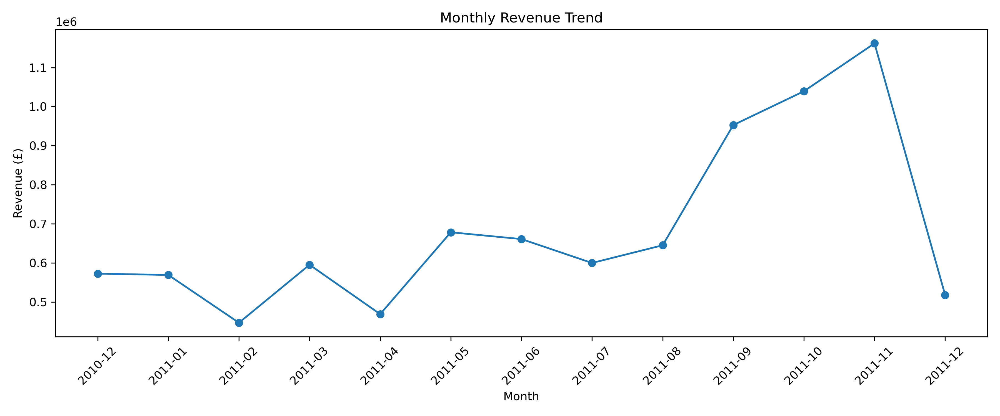
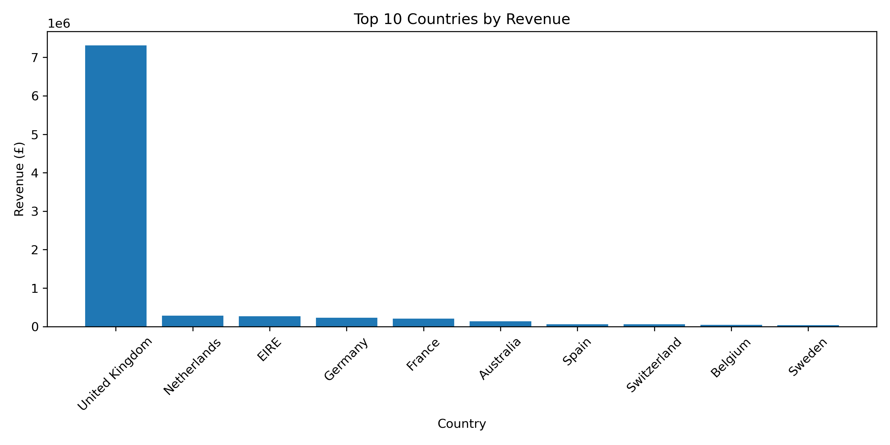
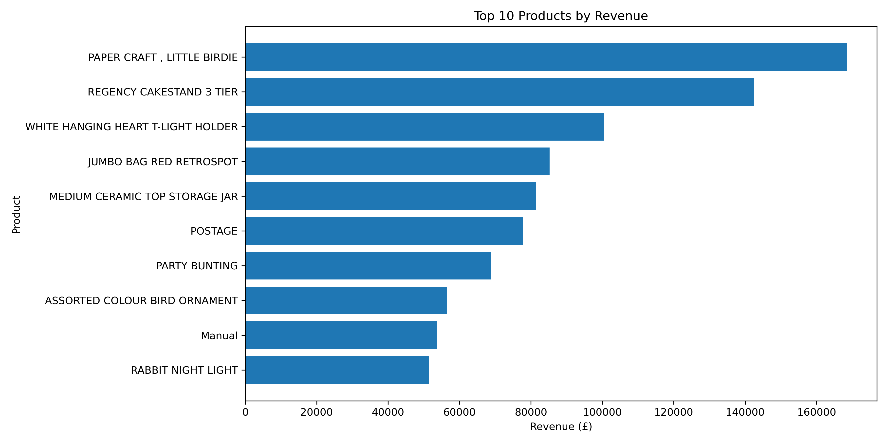
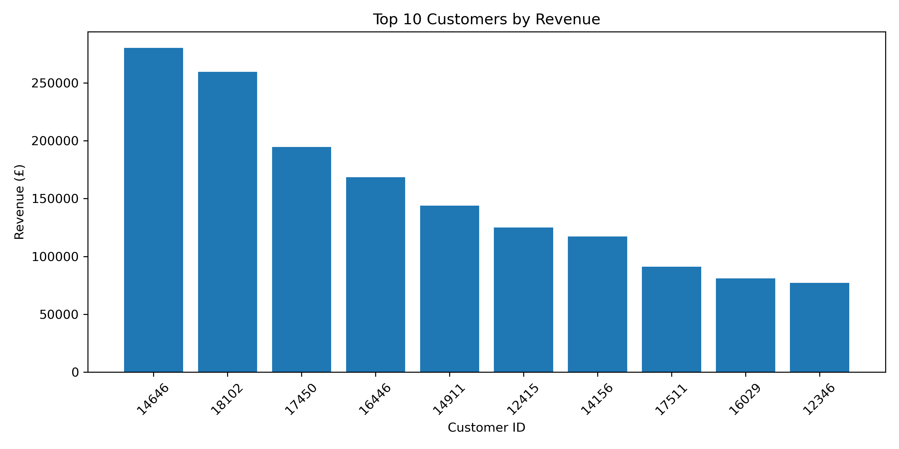
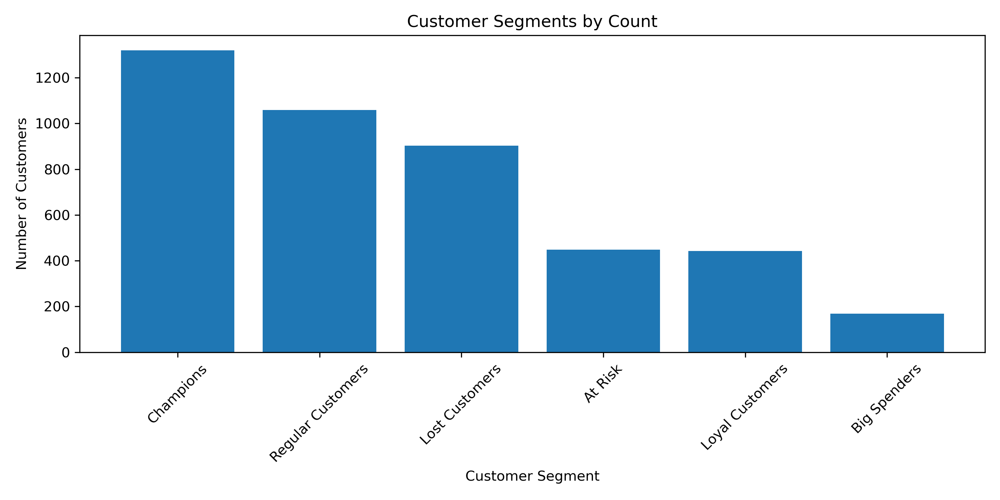
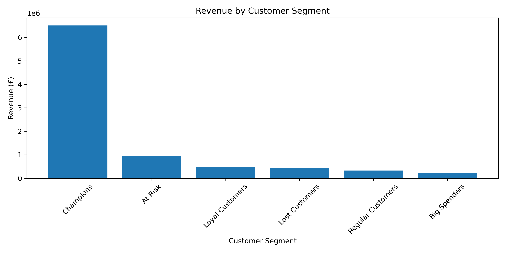
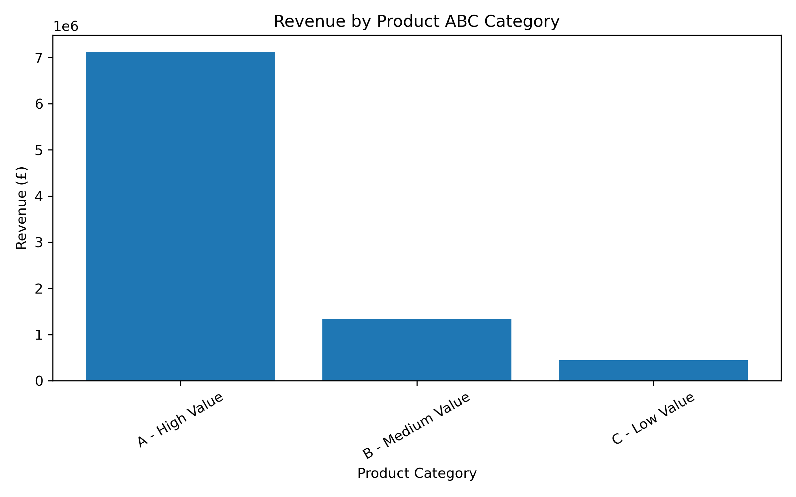
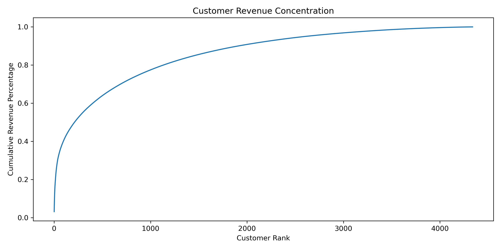
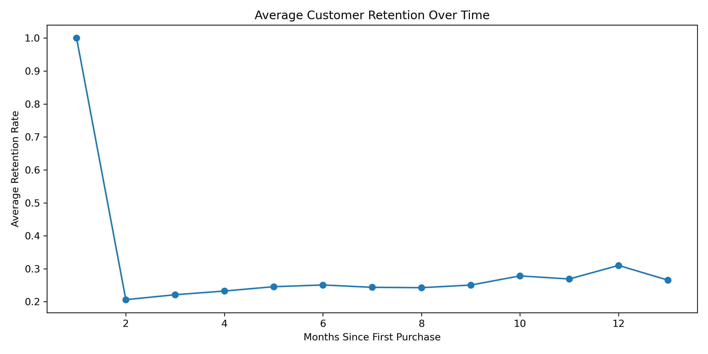

# Online Retail Customer Segmentation & Sales Insights

## Overview

This project analyses online retail transaction data from a UK-based retailer to identify sales trends, customer behaviour, product performance and retention opportunities.

The project demonstrates how raw transactional data can be cleaned, analysed and converted into business recommendations using Python, SQL and customer segmentation techniques.

## Business Problem

The retailer wants to understand:

- Which months generate the most revenue
- Which countries and products perform best
- Which customers are most valuable
- Which customers are loyal, at risk or inactive
- Which products are frequently bought together
- What actions can improve customer retention and revenue

## Dataset

The dataset used is the UCI Online Retail dataset. It contains online transaction records including invoice number, product description, quantity, invoice date, price, customer ID and country.

The raw dataset is not included in this repository. It should be downloaded separately and placed inside `data/raw/`.

## Tools Used

- Python
- Pandas
- Matplotlib
- Jupyter Notebook
- SQLite / SQL
- GitHub

## Key Metrics

- Total Revenue: £8,911,425.90
- Total Orders: 18,532
- Total Customers: 4,338
- Total Products: 3,665

## Analysis Performed

- Monthly revenue trend analysis
- Top countries by revenue
- Top products by revenue
- Top customers by revenue
- RFM customer segmentation
- Product ABC analysis
- Customer value concentration analysis
- Cohort retention analysis
- Bought-together product analysis
- SQL business queries

## Customer Segmentation

RFM analysis was used to segment customers based on:

- Recency: how recently a customer purchased
- Frequency: how often a customer purchased
- Monetary: how much a customer spent

Customer segments created:

- Champions
- Loyal Customers
- Big Spenders
- At Risk
- Lost Customers
- Regular Customers

## Visual Preview

### Monthly Revenue Trend

### Top Countries by Revenue

### Top Products by Revenue

### Top Customers by Revenue

### Customer Segments

### Revenue by Customer Segment

### Product ABC Revenue

### Customer Revenue Concentration

### Average Customer Retention

## Key Findings

- The cleaned dataset generated approximately £8.91 million in revenue.
- A small group of countries contributed strongly to overall revenue.
- RFM segmentation identified high-value, loyal, at-risk and inactive customers.
- Product ABC analysis identified which products contributed most strongly to revenue.
- Customer value concentration analysis showed how much revenue depends on high-value customers.
- Cohort analysis provided insight into customer retention after first purchase.
- Bought-together product analysis identified possible cross-selling and bundling opportunities.

## Recommendations

- Reward Champion customers with loyalty perks and referral campaigns.
- Target At Risk customers with win-back campaigns before they become inactive.
- Prioritise high-value products in marketing and stock planning.
- Create product bundles using items frequently bought together.
- Monitor customer retention by cohort to understand when customers stop returning.
- Use customer segmentation to personalise campaigns.

## How to Run

1. Clone this repository.
2. Download the UCI Online Retail dataset.
3. Place the Excel file inside `data/raw/`.
4. Install dependencies using `pip install -r requirements.txt`.
5. Open and run `notebooks/online_retail_analysis.ipynb`.

## Portfolio Summary

This project demonstrates practical data analysis skills by cleaning raw retail transaction data, analysing sales and customer behaviour, segmenting customers using RFM analysis, and producing business recommendations for revenue growth, retention and cross-selling.